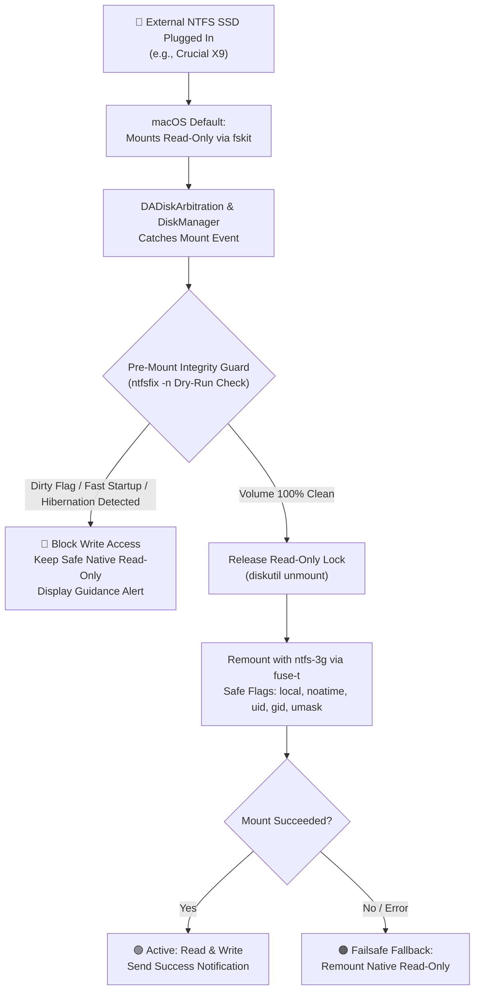

# NTFS Assistant for macOS

<p align="center">
  
  
  
  
</p>

A lightweight, native macOS Menu Bar application that provides seamless, plug-and-play **Read & Write (R/W)** access to external NTFS drives (such as the Crucial X9 1TB SSD, Samsung T7, SanDisk Extreme, and all external NTFS storage). 

Built using battle-tested open-source components (`ntfs-3g` connected via `fuse-t`), **without paid commercial software** (no Paragon, no Tuxera), **without disabling System Integrity Protection (SIP)**, and **without installing deprecated kernel extensions**.

---

## ⚡ Key Highlights

- **Kext-Less & SIP Friendly**: Operates entirely in userspace via `fuse-t` (which uses a local NFS loopback and macOS’s native in-kernel NFS client).
- **Zero Data Loss Guarantee**: Enforces an automated pre-mount dry-run integrity check (`ntfsfix -n`) before writing. If Windows Fast Startup or uncommitted journal transactions are detected, write access is blocked immediately to protect your files.
- **Native macOS Menu Bar App**: Lives quietly in your status bar (`NSStatusItem` / `LSUIElement`) with a live status badge (Green = Read & Write, Orange = Read-Only Protected, Red = Dirty / Fast Startup Lock).
- **Plug-and-Play Automount**: Automatically intercepts Apple's default read-only mount on disk insertion and seamlessly remounts with safe user permissions.
- **Clean Cache Flush & Safe Eject**: Dedicated one-click button flushes dirty filesystem caches to physical NAND (`sync`) before triggering hardware ejection.
- **Universal Binary**: Fully optimized for Apple Silicon (M1/M2/M3/M4) and Intel Macs.

---

## 🛡️ Architecture & Safety Guard



---

## 🚀 Quick Start Guide

### 1. One-Time System & Driver Setup
To configure the userspace `fuse-t` driver and minimal privileged helper rule so mounting works smoothly without repetitive password prompts:

```bash
git clone https://github.com/ShaanAhamedM/NTFSAssistant_MacOS.git
cd NTFSAssistant_MacOS
sudo ./scripts/setup_environment.sh
```

### 2. Launch the Application
Compile and launch the production application bundle:
```bash
./scripts/package_app.sh
open ./build/NTFSAssistant.app
```

The external drive icon will appear in your top-right macOS Menu Bar.

### 3. Keep in macOS Login Items
To have NTFS Assistant start automatically whenever you turn on your Mac:
```bash
osascript -e 'tell application "System Events" to make login item at end with properties {path:"'$(pwd)'/build/NTFSAssistant.app", hidden:false, name:"NTFS Assistant"}'
```
*(You can also verify or toggle this in **System Settings > General > Login Items & Extensions**).*

---

## 🖥️ Menu Bar Interface

| UI Element | Description |
| :--- | :--- |
| **Drive Card** | Displays drive label (e.g., `Crucial X9`), storage size (e.g., `1.0 TB`), and device path (`/dev/disk...`). |
| 🟢 **Read & Write** | Drive is active with full Read & Write capabilities via `ntfs-3g`. |
| 🟠 **Read-Only (Protected)** | Drive is safely mounted using Apple's native read-only driver. |
| 🔴 **Dirty / Unsafe to Write** | Pre-Mount Guard detected Windows Fast Startup / hiberfil lock. R/W is blocked to prevent data loss. |
| **"Mount Read/Write"** | Manually triggers the safe dismount and `ntfs-3g` remount workflow. |
| **"Safe Eject & Sync"** | Flushes dirty write buffers (`sync`), unmounts volume, and ejects the drive safely. |
| **"Check Volume Health"** | Runs non-destructive dry-run `ntfsfix -n` and displays the diagnostic report modal. |
| **"Reveal in Finder"** | Opens the active volume mountpoint in Finder. |

---

## 🔄 Cross-Platform Sharing (macOS ↔ Windows)

**Can I switch the SSD between Mac and Windows freely? YES, 100%!**

Because NTFS is Microsoft’s native filesystem:
- **On Windows**: The SSD is natively plug-and-play. No extra software or configuration is needed. All files created, modified, or moved while on macOS via NTFS Assistant are 100% standard NTFS files that open instantly on Windows.
- **On macOS**: NTFS Assistant gives you full Read & Write access without paid software or kernel modifications.

### Recommended Routine for Moving Between Operating Systems:

```text
[macOS] Click "Safe Eject & Sync"  ──►  [Windows] Plug in & Use Natively  ──►  [Windows] "Safely Remove Hardware"  ──►  [macOS] Plug in & Auto R/W
```

1. **When disconnecting from Mac to connect to Windows**:
   - In NTFS Assistant, click **"Safe Eject & Sync"** (or Eject in Finder).
   - This ensures all pending write buffers are safely flushed (`sync`) to physical NAND flash before you unplug the cable.
2. **When disconnecting from Windows to connect to Mac**:
   - Always click the **"Safely Remove Hardware and Eject Media"** (USB tray icon) in Windows before pulling the cable.
   - This prevents Windows from leaving an uncommitted journal lock on the filesystem.

---

## ⚠️ Resolving Windows Fast Startup (If Red Badge Appears)

If the app detects that Windows did not cleanly unmount the drive:
1. Plug the drive into your Windows computer.
2. In Windows, open **Control Panel > Power Options > Choose what the power buttons do**.
3. Click **"Change settings that are currently unavailable"**.
4. Uncheck **"Turn on fast startup (recommended)"** and click **Save changes**.
5. Perform a normal **Start > Shut down** (do not use Sleep or Hibernate).
6. Reconnect to your Mac — NTFS Assistant will now mount it with full Read & Write access.

---

## 🧪 Comprehensive Automated Testing Suite

We maintain an automated verification pipeline that stress-tests data integrity against synthetic loopback disk images before every release:
- Clean NTFS partition generation & R/W verification.
- Dirty bit injection & Fast Startup rejection test.
- Rapid mount/unmount cycling stress test.
- Shell escaping safety on labels with spaces and special characters.

To run the complete test suite:
```bash
./scripts/run_all_tests.sh
```

---

## 📄 License & Acknowledgements

- **NTFS Assistant** is licensed under the [GNU General Public License v2.0 or later](LICENSE).
- Powered by [NTFS-3G](https://github.com/tuxera/ntfs-3g) by Tuxera (GPLv2/LGPLv2) and [FUSE-T](https://www.fuse-t.org/) (kext-less userspace FUSE).
